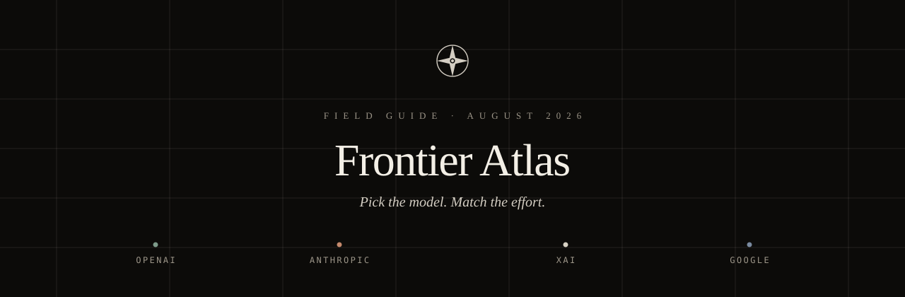
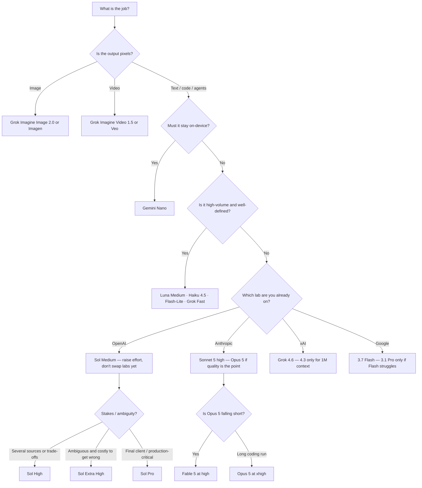

<p align="center">
  
</p>

<p align="center">
  <a href="https://github.com/itsual/frontier-atlas/blob/main/guides/openai.md"></a>
  <a href="https://github.com/itsual/frontier-atlas/blob/main/guides/anthropic.md"></a>
  <a href="https://github.com/itsual/frontier-atlas/blob/main/guides/xai.md"></a>
  <a href="https://github.com/itsual/frontier-atlas/blob/main/guides/google.md"></a>
</p>

<p align="center">
  <em>A field guide to frontier models — which one, how hard it should think, and when to move up.</em><br />
  Current as of <strong>22 August 2026</strong>
</p>

<p align="center">
  <a href="docs/index.html"><strong>Open the interactive desk →</strong></a>
  &nbsp;·&nbsp;
  <a href="#the-five-second-desk">Five-second rule</a>
  &nbsp;·&nbsp;
  <a href="#the-labs">The labs</a>
  &nbsp;·&nbsp;
  <a href="SOURCES.md">Sources</a>
</p>

---

Four labs. Dozens of model IDs. Effort dials that do not mean the same thing twice.

**Frontier Atlas** is a routing desk, not a leaderboard. You describe the work — a client email, a thousand PDFs, a production review — and you get a **model × effort** pair, the reason it fits, and the exact condition that should make you step up. Nothing here is a benchmark claim. Every cell is a documented default, a vendor recommendation, or a compiled activity from the cheat sheets this repo was built from.

> Use the **lowest effort that reliably meets the quality bar.** Higher is not automatically better. Length of the source document is not by itself a reason to reach for High.

## Contents

1. [The five-second desk](#the-five-second-desk)
2. [How to read a recommendation](#how-to-read-a-recommendation)
3. [The labs](#the-labs)
4. [Activity playbook](#activity-playbook)
5. [Principles that actually change the answer](#principles-that-actually-change-the-answer)
6. [Interactive explorer](#interactive-explorer)
7. [What's in this repo](#whats-in-this-repo)
8. [Accuracy & date](#accuracy--date)

---

## The five-second desk

If you only have five seconds, start here.

| Situation | Choose |
| --- | --- |
| I just need a good answer quickly. | **GPT-5.6 Sol Instant** |
| This is normal professional work. | **GPT-5.6 Sol Medium** |
| I have many routine tasks to process. | **GPT-5.6 Luna Medium** |
| I need a capable workhorse for repeated analysis or coding. | **GPT-5.6 Terra Medium** |
| There are several documents, sources, calculations or trade-offs. | **GPT-5.6 Sol High** |
| This is ambiguous, difficult, and important enough to justify deeper checking. | **GPT-5.6 Sol Extra High** |
| This is the final, high-stakes deliverable and a small quality improvement matters. | **GPT-5.6 Sol Pro** |
| The workflow is already validated on GPT-5.5 and consistency matters. | **GPT-5.5 Medium / High** |
| I am shipping a Claude production agent. | **Sonnet 5 at medium or high** |
| Quality is the priority on Claude, including long coding runs. | **Opus 5 at high** (xhigh if the run is long) |
| Opus 5 is visibly falling short. | **Fable 5 at high** |
| Most Grok tasks — chat, research, coding, agents. | **Grok 4.6** |
| Most Gemini work. | **Gemini 3.7 Flash** |

Full activity tables — email, decks, mass-balance reviews, PDF extraction, on-device, video — live in [`guides/`](guides/).



---

## How to read a recommendation

Every pair in this atlas has three layers. Skip any of them and the table becomes folklore.

| Layer | What it answers | What it is not |
| --- | --- | --- |
| **Model** | Which intelligence / speed / cost envelope. | A moral ranking of labs. |
| **Effort** | How much reasoning *this request* is allowed to spend. | A length control. Prompt for length separately. |
| **Move up when** | The condition that should change the pair. | A reason to live on Pro / max all day. |

**Effort names do not travel.** ChatGPT *Instant* is roughly API *light / low / none*. Claude `high` is the default, not a panic setting. Grok consumer *Heavy* is the cousin of API `xhigh`. Gemini mostly routes by **tier** (Flash vs Pro vs Lite), with thinking as a separate control.

If you change effort in the middle of a Claude conversation that relies on prompt caching, you throw the cache away. Vary effort across workloads, not inside a cached thread.

---

## The labs

Four short portraits. Open a guide when you need the full matrix.

<table>
<tr>
<td width="50%" valign="top">

### OpenAI — GPT-5.6
[Full guide](guides/openai.md)

Sol, Terra, and Luna are **capability tiers** inside one generation. The number is the generation; the name is the tier.

| Model | Role | List price (in / out per 1M) |
| --- | --- | --- |
| **Sol** | Flagship. Quality and judgment. | $5 / $30 |
| **Terra** | Everyday workhorse. GPT-5.5's successor for production. | $2.50 / $15 |
| **Luna** | Fast, cheap, well-defined volume. Free/Go default. | $1 / $6 |
| **GPT-5.5** | Legacy. Keep for validated prompts. | — |

Default for mixed professional work: **Sol Medium**.

Sol API/credit pricing was cut by over 20% for three months from 21 August 2026. Luna was cut 80% and Terra 20% on 30 July 2026. Cached input still gets the 90% discount.

</td>
<td width="50%" valign="top">

### Anthropic — Claude 5
[Full guide](guides/anthropic.md)

Effort is a first-class API parameter: `low` · `medium` · `high` · `xhigh` · `max`. It taxes *every* token — text, tools, thinking.

| Model | Role | List price |
| --- | --- | --- |
| **Fable 5** | Ceiling. Long-horizon agents. | $10 / $50 |
| **Opus 5** | Quality-first default. | $5 / $25 |
| **Sonnet 5** | Production agents at volume. | $2 / $10 |
| **Haiku 4.5** | Classify / route / extract. | $1 / $5 |

Default: **Sonnet 5 at `high`** for production; **Opus 5 at `high`** when quality is the point; **Fable 5 at `high`** only when Opus 5 is visibly falling short.

Haiku 4.5 does **not** take `effort`. Use `budget_tokens` instead. Mythos 5 shares Fable's specs and is invitation-only.

</td>
</tr>
<tr>
<td width="50%" valign="top">

### xAI — Grok 4
[Full guide](guides/xai.md)

Official line: start with **Grok 4.6**. Switch only for context, cost, or a specialised surface.

| Model | Role | Context | List price |
| --- | --- | --- | --- |
| **Grok 4.6** | Flagship. Code + everything else. | 500k | $2 / $6 |
| **Grok 4.3** | Longer context, cheaper. | 1M | $1.25 / $2.50 |
| **Grok 4.20 Reasoning** | Hard multi-step analysis. | 1M+ | $1.25 / $2.50 |
| **Grok 4.20 Multi-Agent** | Parallel exploration. | 1M+ | $1.25 / $2.50 |
| **Grok Build 0.1** | Coding specialist. | 256k | $1 / $2 |
| **Fast variants** | Volume / throughput. | up to 2M | ~$0.20 / $0.50 |

Consumer modes: **Auto** · **Think / Expert** · **Heavy** (multi-agent). Grok Build CLI default moved to 4.6 on 12 August 2026. Knowledge cutoff for 4.6: 1 February 2026.

Media: **Imagine Image 2.0**, **Imagine Video 1.5**, **Voice API**.

</td>
<td width="50%" valign="top">

### Google — Gemini 3
[Full guide](guides/google.md)

Google routes primarily by **tier**, not a universal effort dial. The older 1.5 / 2.0 sheet in the original notes has been replaced with the 3.x lineup from Google AI and DeepMind docs.

| Model | Role | Notes |
| --- | --- | --- |
| **3.7 Flash** | Workhorse. Coding + agents. | Start here. 1M in / 64k out. |
| **3.6 / 3.5 Flash** | Previous Flash generations. | Keep if pinned. |
| **Flash-Lite** | High-throughput, cheap. | Downgrade only if the task is simple. |
| **3.1 Pro** | Preview. Heavy lifting. | Upgrade only if Flash struggles. |
| **Nano** | On-device / offline. | Privacy and zero-latency. |

3.7 (and 3.6) Flash introductory price: **$0.75 / $3.75** per 1M through 31 December 2026; **$1.50 / $7.50** from 1 January 2027.

Media: **Imagen**, **Veo**.

</td>
</tr>
</table>

---

## Activity playbook

A sample of the desk. The full list — with *move up when* clauses — is in the interactive explorer and the lab guides.

| Work | Start here | Move up when |
| --- | --- | --- |
| Email / LinkedIn rewrite | **Sol Instant** | Sensitive, political, or multi-stakeholder → Sol Medium |
| Meeting minutes at volume | **Luna Medium** | Ambiguous decisions must be inferred → Sol High |
| Market / competitor research | **Sol High** | Conflicting sources, investment-grade → Extra High |
| Literature review, both sides | **Sol Extra High** | Publication-grade or exec recs → Sol Pro |
| Spreadsheet cleaning | **Luna Medium** | Formulas and business rules → Terra Medium |
| Spreadsheet diagnosis | **Terra Medium / High** | Causal / forecast / strategy → Sol High |
| Slides from a brand template | **Sol High** | Hierarchy + story + fidelity all critical → Extra High |
| Routine coding | **Terra Medium** · **Grok 4.6** · **Sonnet 5 high** · **3.7 Flash** | Architecture / unfamiliar repo → Sol High |
| Production-critical review | **Sol Extra High** | Security, data-loss, deploy risk → Sol Pro or Fable 5 |
| Bulk PDF / form extraction | **Luna Medium** · **Haiku 4.5** | Exceptions only → Terra High / Sol High |
| Long-running coding agent | **Fable 5 high** or **Opus 5 xhigh** | Give a large `max_tokens` (start at 64k) |
| On-device / offline | **Gemini Nano** | — |
| Image / video | **Imagine** or **Imagen / Veo** | — |

---

## Principles that actually change the answer

1. **Lowest effort that meets the bar.** OpenAI, Anthropic, and xAI all publish this. Raise effort only where representative evals show a gain.
2. **Effort is not length.** On Claude Opus 5, changing effort does not reliably shorten responses. Say how long you want the answer.
3. **Raise effort, don't prompt around it.** If reasoning is shallow, turn the dial. If the prompt is vague, Extra High / `max` will over-analyse.
4. **Don't flip effort mid-cache.** Claude invalidates prompt cache when `effort` changes.
5. **Re-sweep on migrate.** Opus 4.8's "start at `xhigh` for coding" is replaced by "start at `high`" for Opus 5 and Fable 5. GPT-5.5 prompts should be A/B'd against Terra and Sol before a silent cutover.
6. **A long document is not a hard problem.** Instant / `low` / Flash-Lite will summarise a 80-page PDF. High is for trade-offs, not page count.

---

## Interactive explorer

This repository ships a **static desk** you can open without installing anything:

**[docs/index.html](docs/index.html)** — select a lab, a model, and an effort; search an activity; compare two models side by side.

To run it locally:

```bash
git clone https://github.com/itsual/frontier-atlas.git
cd frontier-atlas
# open docs/index.html in a browser
python3 -m http.server 8080 --directory docs
```

To publish it from this repo: GitHub Settings → Pages → Deploy from branch → `/docs`.

---

## What's in this repo

```
.
├── README.md                 ← you are here
├── SOURCES.md                ← every vendor URL we trusted
├── CONTRIBUTING.md           ← how to propose a dated correction
├── LICENSE
├── assets/banner.svg
├── guides/
│   ├── openai.md             ← GPT-5.6 Sol / Terra / Luna / 5.5
│   ├── anthropic.md          ← Fable 5 · Opus 5 · Sonnet 5 · Haiku 4.5
│   ├── xai.md                ← Grok 4.6 and the rest of the family
│   └── google.md             ← Gemini 3.x, Nano, Imagen, Veo
└── docs/index.html           ← interactive desk
```

---

## Accuracy & date

Compiled **22 August 2026** from:

- the four source cheat sheets that seeded this repo
- OpenAI, Anthropic, xAI, Google DeepMind, and Google AI developer docs linked in [`SOURCES.md`](SOURCES.md)

Gemini was updated from the original 1.5 / 2.0 sheet to the **Gemini 3** family using Google's own model pages. Prices are **vendor API list** unless a dated promotion is noted. Availability, effort defaults, and list prices change — re-read the linked docs before you standardise a production path.

Vendor names and model names are trademarks of their owners. This is an independent routing aid, not an official product of any lab.

<p align="center"><br /><em>Pick the model. Match the effort. Then get back to the work.</em></p>
